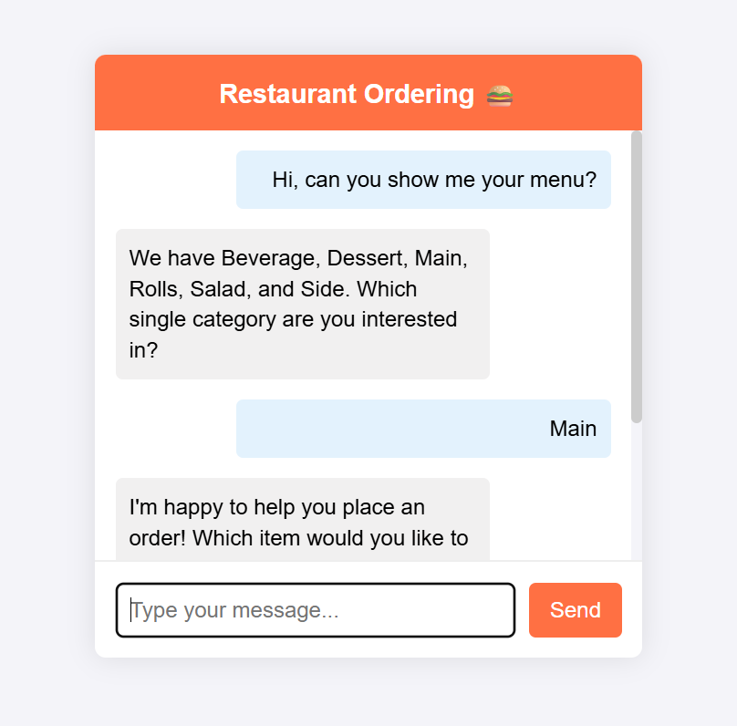

# Restaurant Chatbot

This project is a **Model Context Protocol (MCP)**-based FastAPI chat application that allows users to interact with a restaurant chatbot. Powered by **LLaMA 3.2**, the chatbot can browse the menu, place orders, and manage existing orders through contextual tool use and structured reasoning.



## Key Features

- 🤖 Context-aware chatbot using **MCP (Model Context Protocol)**
- 🧠 Powered by **LLaMA 3.2** for natural language understanding and reasoning
- 🍽️ Tool-based interactions: browse menu, place order, check status
- ⚡ FastAPI backend with lightweight frontend interface
- 🗃️ SQLite database for menu and order management

## Project Structure

```
.
├── app/                      # Main application logic
│   ├── __init__.py
│   ├── main.py               # FastAPI main application, agent setup
│   ├── restaurant_server.py  # MCP server with restaurant tools
│   └── db_setup.py           # SQLite database setup and population
├── data/                     # Data files
│   ├── restaurant.db         # SQLite database
│   └── example.png           # Example chat interface screenshot
├── static/                   # Static files for the frontend
│   ├── index.html            # Main HTML page for the chat interface
│   ├── style.css             # CSS styles
│   └── script.js             # JavaScript for frontend logic
├── .gitignore
├── requirements.txt
└── README.md
```

## Setup and Installation

1. **Clone the repository:**
   ```bash
   git clone <your-repository-url>
   cd <your-project-directory>
   ```

2. **Create and activate a virtual environment:**
   ```bash
   python -m venv venv
   # On Windows
   .\venv\Scripts\activate
   # On macOS/Linux
   source venv/bin/activate
   ```

3. **Install dependencies:**
   ```bash
   pip install -r requirements.txt
   ```

4. **Set up the database:**
   ```bash
   python -m app.db_setup
   ```
   This will create `restaurant.db` in the `data/` directory with sample menu data.

## Running the Application

1. **Start the FastAPI server:**
   ```bash
   python app/main.py
   ```
   Or with Uvicorn:
   ```bash
   uvicorn app.main:app --reload --host 0.0.0.0 --port 8000
   ```

2. **Open your browser:**
   Visit [http://localhost:8000](http://localhost:8000) to interact with the chatbot.

## How It Works

- **Model Context Protocol (MCP):** Defines structured tools (like `browse_menu`, `place_order`) that the chatbot can invoke.
- **LLaMA 3.2:** Acts as the reasoning engine, selecting appropriate tools and generating intelligent responses.
- **FastAPI (`app/main.py`):** Serves the backend API and static frontend files.
- **MCP Server (`app/restaurant_server.py`):** Implements and registers the tools accessible to the model.
- **SQLite (`data/restaurant.db`):** Stores all menu items and user orders.
- **Frontend (`static/`):** Simple HTML/CSS/JS interface for chatting with the bot.

## To-Do / Potential Enhancements

- [ ] User authentication and session management
- [ ] Real-time order tracking with WebSockets
- [ ] More complex menu options (e.g. modifiers, combos)
- [ ] Payment integration (e.g. Stripe)
- [ ] Docker support and deployment instructions

---

Feel free to fork, extend, or adapt this chatbot for your own restaurant or service-based applications!
